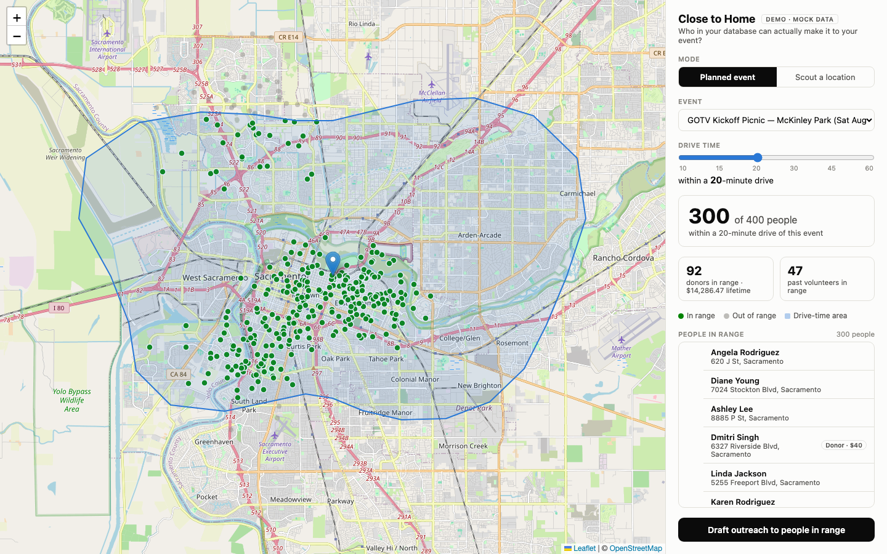

# Close to Home

Demo of AI-enabled tooling for political campaigns, built as a ~60-minute wireframe on 2026-07-30.

**The pitch:** a field organizer is deciding where to hold an event (GOTV picnic, postcard party, canvass launch) and wants it to be convenient for people already in the campaign's database. This dashboard draws the N-minute **drive-time polygon** (isochrone) around an event location, lights up everyone in the "NGP database" who lives inside it, and drafts the "this event is 15 minutes from your house" text/email blast.



## What's real vs. what's fake

| Real | Fake |
|---|---|
| Google Isochrones API call (when a key is set) | All people/donor data (seeded, generated) |
| Point-in-polygon math (shapely) | NGP read/write — the app never calls NGP |
| The map, all geometry, the live slider | Message sending ("Send via NGP" just flips UI state) |
| | The 3 events |

The mock people data is **field-shaped exactly like the NGP VAN v4 API** (`vanId`, `addresses[].geoLocation`, `phones[].smsOptInStatus`, `contributionSummary`, …) — verified against the "AI Dems Training NGP" sandbox via the NGP MCP connector. Swapping in real data later means replacing `mock_ngp.py` with a VAN API client, nothing else. The demo is set in **Sacramento, CA** because that's where the sandbox's records live.

## Run it

```bash
uv sync
uv run uvicorn close_to_home.app:app --reload --port 8000
# open http://localhost:8000
```

Works with **zero API keys** — without one, isochrones are procedurally generated plausible blobs. To use real Google geometry:

```bash
cp .env.example .env   # paste GOOGLE_MAPS_API_KEY=... into .env, restart
```

You'll know the real API is active when the polygon hugs the road network instead of being a smooth blob. Failures fall back to the fake polygon with a log warning.

## Architecture

Python 3.12, FastAPI backend, single-file vanilla-JS frontend. No build step, no database.

```
src/close_to_home/
  app.py        # FastAPI app + endpoints (below)
  mock_ngp.py   # 400 seeded fake people, VAN-v4-shaped, clustered in 5 Sacramento neighborhoods
  events.py     # 3 hardcoded demo events (real venues, fake events)
  isochrone.py  # get_isochrone(lat, lng, minutes): real Google call OR procedural fallback, cached
static/
  index.html    # entire UI: Leaflet map, slider, scout mode, stats, outreach modal
```

### API

- `GET /api/people` — all mock people (VAN-shaped, plus flattened `lat`/`lng`/`neighborhood` for the frontend)
- `GET /api/events` — the 3 demo events
- `POST /api/reachable` `{lat, lng, minutes}` → `{polygon: <GeoJSON MultiPolygon>, insideVanIds: [...], stats: {inside, total, donorsInside, donorTotalAmount, volunteersInside}}`

### UI features

- **Event mode**: pick one of the 3 events; **Scout mode**: click anywhere on the map to test a hypothetical location.
- **Drive-time slider**: detents at 10/15/20/30/45/60 min (60 is a hard cap — Google's DRIVE mode maxes at 3600s). Fires on release.
- **Outreach modal**: Text/Email tabs, editable `{firstName}` template, live preview, fake send → "queued ✓" badges.

## Google Isochrones API notes (verified July 2026)

- `POST https://isochrones.googleapis.com/v1/isochrones:generate`, auth via `X-Goog-Api-Key` header. **Pre-GA Preview** product — enable "Isochrones API" in the GCP console before the key will work.
- Request: `{location: {latitude, longitude}, travelMode: "DRIVE", travelDirection: "TO", travelDuration: "1200s", routingPreference: "TRAFFIC_AWARE", enableSmoothing: true}`. `"TO"` = who can reach the event (what we want).
- Response: `{isochrone: {geoJson: <RFC 7946 MultiPolygon>}}`, coordinates `[lng, lat]`.
- No transit mode (DRIVE/WALK/BICYCLE only).

## Tuning knobs

- `KM_PER_MINUTE_DRIVING` in `isochrone.py` — how far the fake polygon reaches per minute (0.5 km/min). Lower = more slider drama.
- `SEED` / `N_PEOPLE` / `CLUSTERS` in `mock_ngp.py` — regenerate the fake universe.

## Not built (stretch ideas, in priority order)

1. **Mobilize import** — Mobilize's API has public no-auth endpoints (`GET https://api.mobilize.us/v1/organizations/{id}/events`) with geocoded lat/lngs; could pull real public events into the dropdown.
2. **"Find best spot"** — in scout mode, rank ~12 candidate locations by people-reached.
3. Walk/bike mode toggle.
4. Real NGP integration (needs an API key; mock data is already shape-compatible).
